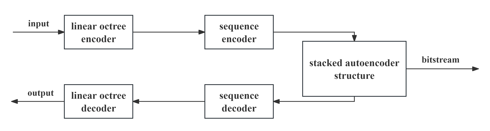

# Stacked Autoencoder-based Compression of Point Cloud Geometry

Xuewei Cao, Wenbiao Zhou, Shuyu Yan, Genpei Liu

> **Abstract:** *Point clouds have found widespread use across various domains, but their large data volumes bring significant challenges in terms of storage, transmission, and processing. Traditional 2D image and video compression techniques are not suitable for point cloud compression due to their inherent spatial irregularity and sparsity. Inspired by the success of autoencoders in visual tasks and image compression, this paper introduces a novel method for point cloud geometry compression based on stacked autoencoders. The proposed method first encodes the point cloud using Morton codes and subsequently converts them into integer sequences. Stacked autoencoders are then employed to reduce the dimensions of these sequences, achieving efficient compression. Experiment results demonstrate that proposed method outperforms PCL, G-PCC(octree) and G-PCC(trisoup) in both reconstruction quality as well as compression ratio, especially for small point clouds with fewer points. By increasing the depth of Morton encoding, proposed method can even achieve lossless compression, highlighting its potential as an effective geometry compression technique for point clouds.* 
<hr />

## Compression Architecture


## Installation
1. Clone our repository
```
git clone https://github.com/XueweiCao/SAE-GPCC.git
cd SAE-GPCC
```
2. Make conda environment
```
conda create -n sae_gpcc python = 3.10
conda activate sae_gpcc
```
3. Install dependencies
```
pip install -r requirements.txt
```

## Train
1. Put datasets in ./datasets/train/
2. Train models
```
python ./train.py
```
3. Train results will be saved in ./run/train/

## Test
1. Put trained models in ./model/option/
2. Put datasets in ./datasets/test/
3. Test datasets
```
python ./test.py
```
4. Test results will be saved in ./run/test/
